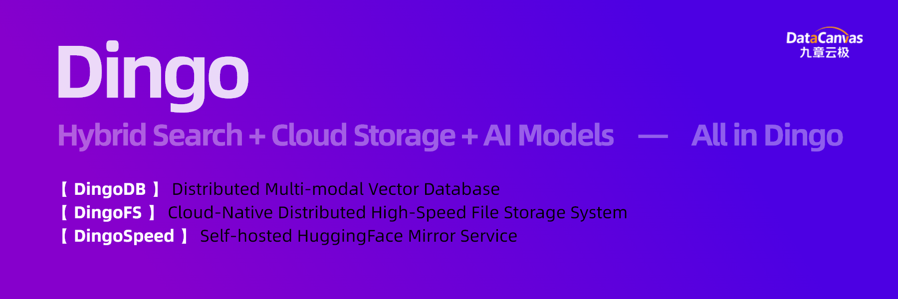

 

**Dingo** products, designed and developed by [DataCanvas](https://www.datacanvas.com/), comprises a range of innovative solutions, including [DingoDB](https://github.com/dingodb/dingo), [DingoFS](https://github.com/dingodb/dingofs) and [DingoSpeed](https://github.com/dingodb/DingoSpeed). Each product delivers unique features and serves distinct application scenarios. Below is a detailed overview.

----
<div align=center> 

##### English | [简体中文](README_cn.md)

####  📝[DingoDB](#header1) |  📂[DingoFS](#header2) |  ⚡[DingoSpeed](#header3) 

<div class="column" align="middle">
  </a>
    
  </a>
    
  </a>
    
</div>
<div align=left>

<a id="header1"></a>
# 📝DingoDB
[DingoDB](https://github.com/dingodb/dingo) is an open-source distributed multi-modal vector database, which integrates real-time strong consistency, relational semantics, and vector semantics into a unified platform, DingoDB positioning itself as a distinctive multi-modal database solution. With exceptional horizontal scalability and elastic scaling capabilities, it effortlessly meets enterprise-grade high availability requirements.

<details>
  <summary><b>Key Features</b></summary>  

✔️ **Comprehensive access interface**
  DingoDB provides comprehensive access interfaces, supporting various flexible access modes such as SQL, SDK, and API to meet the needs of different developers. Additionally, it introduces Table and Vector as first-class citizen data models, providing users with efficient and powerful data processing capabilities.

✔️ **Built-in data high availability**

  DingoDB provides fully functional and highly available built-in configurations without the need to deploy any external components, which can significantly reduce users' deployment and operation and maintenance costs and significantly improve the efficiency of system operation and maintenance.

✔️ **Fully automatic elastic data sharding**

  DingoDB supports dynamic configuration of data shard size, automatic splitting and merging, realizing efficient and friendly resource allocation strategies, and easily responding to various business expansion needs.

✔️ **Scalar-vector hybrid retrieval**

  DingoDB supports both traditional database index types and various vector index types, providing a seamless scalar and vector hybrid retrieval experience, reflecting industry-leading retrieval capabilities. In addition, it also supports fusion of scalars, vectors and text. Distributed transaction processing.

✔️ **Built-in real-time index optimization**

  DingoDB can build scalar and vector indexes in real time, providing users with unconscious background automatic index optimization. At the same time, it ensures no delays during data retrieval.

✔️ **Cold-Hot Tiered Retrieval for Massive Datasets**

  DingoDB provides disk-based vector search capabilities to minimize memory consumption, and supports dynamic switching between different indexes based on data scale requirements.
</details>

<details>
  <summary><b>Get Start</b></summary>
  
- <b>All Documentation</b>
[DingoDB Docs](https://dingodb.readthedocs.io/en/latest/)

- <b>Install</b>
How to install and deploy [Docker](https://dingodb.readthedocs.io/en/latest/deployment/deploy_in_single_node_using_docker.html) or [Ansible](https://dingodb.readthedocs.io/en/latest/deployment/deploy_on_cluster_by_ansible.html#)

- <b>Usage</b>
How to use DingoDB [Usage](https://dingodb.readthedocs.io/en/latest/usage/how_to_use_dingodb.html)
</details>

<details>
  <summary><b>Developing DingoDB</b></summary>  

- <b>VS Code</b>
  We recommend [VS Code](https://code.visualstudio.com/) to develop the DingoDB codebase. 

</details>

<a id="header2"></a>
# 📂DingoFS
[DingoFS](https://github.com/dingodb/dingofs) is a cloud-native distributed high-speed file storage system. It integrates multiple features such as elasticity, multi-cloud compatibility, multi-protocol convergence, and exceptional performance. By leveraging its multi-tiered, multi-type, and high-performance distributed multi-level caching architecture, DingoFS accelerates data I/O for AI workflows, effectively addressing burst I/O challenges in AI scenarios.

<details>
  <summary><b>Key Features</b></summary>

✔️ **POSIX Compliance**

  DingoFS delivers a native file system-like operational experience, enabling seamless system integration.

✔️ **AI-Native Architecture**

  Deeply optimized for large language model (LLM) workflows, efficiently managing massive training datasets and checkpoint workloads.

✔️ **S3 Protocol Compatibility**

  DingoFS supports standard S3 interface protocols for streamlined access to filesystem namespace resources.

✔️ **Fully Distributed Architecture**

  DingoFS's metadata Service (MDS), data storage layer, caching system, and client components all support linear scalability.

✔️ **Exceptional Performance**

  Combines SSD-level low-latency responsiveness with object storage-grade elastic throughput capacity.

✔️ **Intelligent Caching Acceleration System**

  DingFS implements a three-tier caching topology (memory/local SSD/distributed cluster) to deliver high-throughput, low-latency intelligent I/O acceleration for AI workloads.
</details>

<details>
  <summary><b>Get Start</b></summary>

- <b>All Documentation</b>
[DingoFS Docs](https://dingofs.readthedocs.io/en/latest)

**1. Setup Dingo-eureka and Dingo-sdk**
If you installed the software using a [Docker](./Docs/Docker.md) container, the container already includes pre-integrated [Dingo-eureka](https://github.com/dingodb/dingo-eureka) and [Dingo-sdk](https://github.com/dingodb/dingo-sdk), no additional installation is required.

**2. Install jemalloc**
```shell
wget https://github.com/jemalloc/jemalloc/releases/download/5.3.0/jemalloc-5.3.0.tar.bz2
tar -xjvf jemalloc-5.3.0.tar.bz2
cd jemalloc-5.3.0 && ./configure && make && make install
```

**3. Download dep**
```sh
git submodule sync
git submodule update --init --recursive
```

**4. Build Etcd Client**
```sh
bash build_thirdparties.sh
```

**5. Build**
```sh
mkdir build
cd build
cmake ..
make -j 32
```
</details>

<details>
  <summary><b>Developing DingoFS</b></summary>

- **Install Dependencies**
We recommend Rocky and Ubuntu to develop the DingoFS codebase.
- **GCC 13**
We recommend using GCC 13 as the primary compiled language.
</details>

<a id="header3"></a>
# ⚡DingoSpeed
[DingoSpeed](https://github.com/dingodb/DingoSpeed) is a self-hosted Huggingface image service, which provides users with a convenient and efficient solution for accessing and managing model resources. Through local mirroring, users can reduce their reliance on remote Hugging Face servers, improve resource acquisition speed, and achieve local storage and management of data.

<details>
  <summary><b>Key Features</b></summary>

**✔️ Mirror Acceleration**

Cache the resources downloaded for the first time. When the client makes a subsequent request, the data will be read from the cache and returned, greatly improving the download rate.

**✔️ Convenient Access**

There is no need for scientific internet access or complex network configuration. Simply deploy the DingoSpeed service and use it as the proxy address to easily complete the download.

**✔️ Traffic Reduction and Load Alleviation**

Download once and use multiple times, reducing the traffic waste caused by repeated downloads, which is efficient and saves traffic.

**✔️ Localized Management**

Cover the entire process of local compilation, deployment, monitoring, and usage of the mirror service, bringing an excellent and flexible experience. It avoids reliance on external networks and public mirror repositories, significantly improving the system's response speed and data security.
</details>

<details>
  <summary><b>Installation</b></summary>

The project uses the wire command to generate the required dependency code. Install the wire command as follows：
```
# Import into the project
go get -u github.com/google/wire

# Install the command
go install github.com/google/wire/cmd/wire
```
Wire is a flexible dependency injection tool that completes dependency injection at compile time by automatically generating code. In the dependency relationships between various components, explicit initialization is usually used instead of passing global variables. Therefore, using Wire to initialize the code can effectively solve the coupling between components and improve code maintainability.

> This project uses go mod to manage dependencies and requires Go version 1.23 or higher. It uses makefile to manage the project and requires the make command.

```
# 1. Install dependencies
make init

# 2. Generate code
make wire

# 3. Compile the executable file for the current system version
make build

# 4. Compile the Linux executable file on macOS
make macbuild

# 5. Add a license to each file
make license
```
</details>

<details>
  <summary><b>Quick Start</b></summary>

>💡 Deploy the compiled binary file and execute ./dingo-hfmirror to start the service. Then set the environment variable HF_ENDPOINT to the mirror site (here it is http://localhost:8090/).

Linux:
```
export HF_ENDPOINT=http://localhost:8090
```
Windows Powershell:
```
$env:HF_ENDPOINT = "http://localhost:8090"
```
From now on, all download operations in the Hugging Face library will be proxied through this mirror site. You can install the Python library to try it out:
```
pip install -U huggingface_hub
```
```
from huggingface_hub import snapshot_download

snapshot_download(repo_id='Qwen/Qwen-7B', repo_type='model',
local_dir='./model_dir', resume_download=True,
max_workers=8)
```
Alternatively, you can use the Hugging Face CLI to directly download models and datasets. Download GPT2:
```
huggingface-cli download --resume-download openai-community/gpt2 --local-dir gpt2
```
Download a single file:
```
huggingface-cli download --resume-download --force-download  HuggingFaceTB/SmolVLM-256M-Instruct config.json
```
Download WikiText:
```
huggingface-cli download --repo-type dataset --resume-download Salesforce/wikitext --local-dir wikitext
```
You can view the path ./repos, where the caches of all datasets and models are stored.

</details>

### DataCanvas

DingoDB & DingoFS & DingoSpeed are Sponsored by [DataCanvas](https://www.datacanvas.com/), a new platform to do data science and data process in real-time.welcome any feedback from the community.