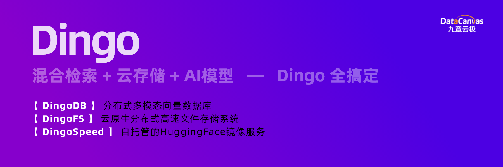

 

**Dingo** 系列产品由 [九章云极 DataCanvas](https://www.datacanvas.com/) 设计并开发，涵盖一系列创新解决方案，包括 [DingoDB](https://github.com/dingodb/dingo)、 [DingoFS](https://github.com/dingodb/dingofs) 和 [DingoSpeed](https://github.com/dingodb/DingoSpeed)。每款产品均具备独特功能，并针对不同的应用场景提供专属支持。

----
<div align=center> 

##### [English](README.md) | 简体中文

####  📝[DingoDB](#header1) |  📂[DingoFS](#header2) |  ⚡[DingoSpeed](#header3) 

<div class="column" align="middle">
  </a>
    
  </a>
    
  </a>
    
</div>
<div align=left>

<a id="header1"></a>
# 📝 DingoDB

[DingoDB](https://github.com/dingodb/dingo) 是一个开源的分布式多模态向量数据库，它将实时强一致性、关系语义和向量语义整合到一个统一的平台中，具备卓越的水平扩展能力和弹性扩展能力，能够轻松满足企业级高可用性要求。
<details>
  <summary><b>核心特性</b></summary>  

✔️ **多种访问接口支持**

同时提供SQL、SDK、API等多种访问模式，同时支持Table和Vector作为First-Class Citizen.

✔️ **内建数据高可用**

无需部署任何外部组件，所有功能和高可用全内置，部署和运维成本极低

✔️ **全自动弹性数据分片**

数据分片大小动态配置、自动分裂和合并，同时为用户提供灵活的空间和资源配置策略

✔️ **联合查询和分布式事务**

同时支持传统数据库索引类型和丰富的向量索引类型，无缝衔接的标量向量文本混合检索体验，具备领先业界的检索能力，支持融合标量向量的分布式事务

✔️ **实时索引构建优化**

实时构建标量和向量索引，具备用户无感知的后台自动索引优化，提供无延迟的数据检索能力支持

✔️ **海量数据的冷热分级检索**

提供基于磁盘的向量检索能力，使得内存消耗降到最低，支持基于数据规模进行不同索引的切换能力
</details>

<details>
  <summary><b>快速开始</b></summary>
  
- <b>文档</b>
[DingoDB 产品手册](https://dingodb.readthedocs.io/en/latest/)

- <b>安装</b>
如何安装部署 [Docker](https://dingodb.readthedocs.io/en/latest/deployment/deploy_in_single_node_using_docker.html) 或 [Ansible](https://dingodb.readthedocs.io/en/latest/deployment/deploy_on_cluster_by_ansible.html#)

- <b>使用</b>
DingoDB的 [接入方式](https://dingodb.readthedocs.io/en/latest/usage/how_to_use_dingodb.html)
</details>

<details>
  <summary><b>DingoDB开发</b></summary>  

- <b>VS Code</b>
  推荐使用 [VS Code](https://code.visualstudio.com/) 来开发DingoDB代码库。 

</details>

<a id="header2"></a>
# 📂 DingoFS
[DingoFS](https://github.com/dingodb/dingofs) 是一个云原生分布式高速文件存储系统，具备弹性、多云、多协议融合、高性能等特征，DingoFS 通过多层次、多类型、高性能的分布式多级缓存体系进行AI业务流程的数据I/O加速，能够有效解决 AI 场景中瞬时 Burst I/O 的需求，同时也提供Local Cache存储能力，满足大模型的全生命周期存储需求。

<details>
  <summary><b>核心特性</b></summary>

✔️ **POSIX兼容性**

提供与本地文件系统一致的操作体验，实现无缝系统集成。

✔️ **AI原生架构**

深度优化大语言模型工作流，高效管理海量训练数据集与检查点工作负载。

✔️ **S3协议兼容**

支持标准S3接口协议，实现对文件系统命名空间的便捷访问。

✔️ **全分布式架构**

元数据服务(MDS)、数据存储层、缓存系统及客户端组件均支持线性扩展。

✔️ **卓越性能表现**

提供兼具本地SSD的低延迟访问性能，同时具备对象存储级的高吞吐能力，满足高性能计算与大容量存储需求。

✔️ **智能缓存加速体系**

构建内存、本地SSD和分布式集群三级缓存拓扑，动态优化数据访问路径，为AI等高负载场景提供高吞吐、低延迟的I/O加速。

</details>

<details>
  <summary><b>快速开始</b></summary>

- <b>文档</b>
[DingoFS 产品手册](https://dingofs.readthedocs.io/en/latest)

**1. 安装 Dingo-eureka 和 Dingo-sdk**
如果您是通过 [Docker](./Docs/Docker.md) 容器来安装软件，该容器已预先集成了 [Dingo-eureka](https://github.com/dingodb/dingo-eureka) 和 [Dingo-sdk](https://github.com/dingodb/dingo-sdk)，无需进行额外安装。
**2. 安装 jemalloc**
```shell
wget https://github.com/jemalloc/jemalloc/releases/download/5.3.0/jemalloc-5.3.0.tar.bz2
tar -xjvf jemalloc-5.3.0.tar.bz2
cd jemalloc-5.3.0 && ./configure && make && make install
```

**3. 下载 dep**
```sh
git submodule sync
git submodule update --init --recursive
```

**4. 安装 Etcd 客户端**
```sh
bash build_thirdparties.sh
```

**5. 安装**
```sh
mkdir build
cd build
cmake ..
make -j 32
```
</details>

<details>
  <summary><b>DingoFS 开发</b></summary>

- **安装依赖**
推荐使用 Rocky 和 Ubuntu 来开发 DingoFS 代码库。
- **GCC 13**
推荐使用 GCC 13 作为主要编程语言。
</details>

<a id="header3"></a>
# ⚡DingoSpeed
[DingoSpeed](https://github.com/dingodb/DingoSpeed) 是一个自托管的 Hugging Face 镜像服务，旨在为用户提供便捷、高效的模型资源访问和管理解决方案。通过本地镜像，用户可以减少对远程 Hugging Face 服务器的依赖，提高资源获取速度，同时实现数据的本地化存储和管理。
<details>
  <summary><b>核心特性</b></summary>

**✔️镜像加速**
将首次下载的资源做缓存，客户端下次请求时将从缓存读取并返回，极大提升下载速率。

**✔️便捷访问**
无需科学上网及复杂的网络配置，只需部署DingoSpeed服务，并将其作为代理地址，即能方便的完成下载。

**✔️缩流减载**
一次下载多次使用，减少重复下载带来的流量浪费，高效且省流。

**✔️本地化管理**
实现镜像服务本地编译、部署、监控及使用的全流程覆盖，带来灵活可控的卓越体验，避免了对外部网络和公共镜像仓库的依赖，显著提升了系统的响应速度和数据安全性。
</details>

<details>
  <summary><b>安装</b></summary>

项目会使用wire命令生成所需的依赖代码，安装wire命令如下：
```
# 导入到项目中
go get -u github.com/google/wire

# 安装命令
go install github.com/google/wire/cmd/wire
```
Wire 是一个灵活的依赖注入工具，通过自动生成代码的方式在编译期完成依赖注入。 在各个组件之间的依赖关系中，通常显式初始化，而不是全局变量传递。 所以通过 Wire 进行初始化代码，可以很好地解决组件之间的耦合，以及提高代码维护性。

> 本项目使用go mod管理依赖，需要go1.23以上版本。使用makefile管理项目，需要make命令。

```
# 1. 安装依赖
make init

# 2. 代码生成
make wire

# 3. 编译可执行文件，当前系统版本
make build

# 4. mac上编译linux可执行文件
make macbuild

# 5. 为每个文件添加licence
make license
```
</details>

<details>
  <summary><b>快速开始</b></summary>

>💡 将编译生成的二进制部署文件，执行./dingospeed启动。然后将环境变量HF_ENDPOINT设置为镜像站点(http://localhost:8090/)。

Linux:
```
export HF_ENDPOINT=http://localhost:8090
```
Windows Powershell:
```
$env:HF_ENDPOINT = "http://localhost:8090"
```
从现在开始，HuggingFace库中的所有下载操作都将通过此镜像站点代理进行。可以安装python库试用：
```
pip install -U huggingface_hub
```
```
from huggingface_hub import snapshot_download

snapshot_download(repo_id='Qwen/Qwen-7B', repo_type='model',
local_dir='./model_dir', resume_download=True,
max_workers=8)
```
或者你也可以使用huggingface cli直接下载模型和数据集. 下载GPT2:
```
huggingface-cli download --resume-download openai-community/gpt2 --local-dir gpt2
```
下载单个文件：
```
huggingface-cli download --resume-download --force-download  HuggingFaceTB/SmolVLM-256M-Instruct config.json
```
下载WikiText:
```
huggingface-cli download --repo-type dataset --resume-download Salesforce/wikitext --local-dir wikitext
```
您可以查看路径./repos，其中存储了所有数据集和模型的缓存。
</details>

### 九章云极 DataCanvas

DingoDB、DingoFS 和 DingoSpeed 由 [九章云极 DataCanvas](https://www.datacanvas.com/) 设计与开发，这是一个用于实时数据科学和数据处理的新平台。欢迎您通过社区进行任何反馈。